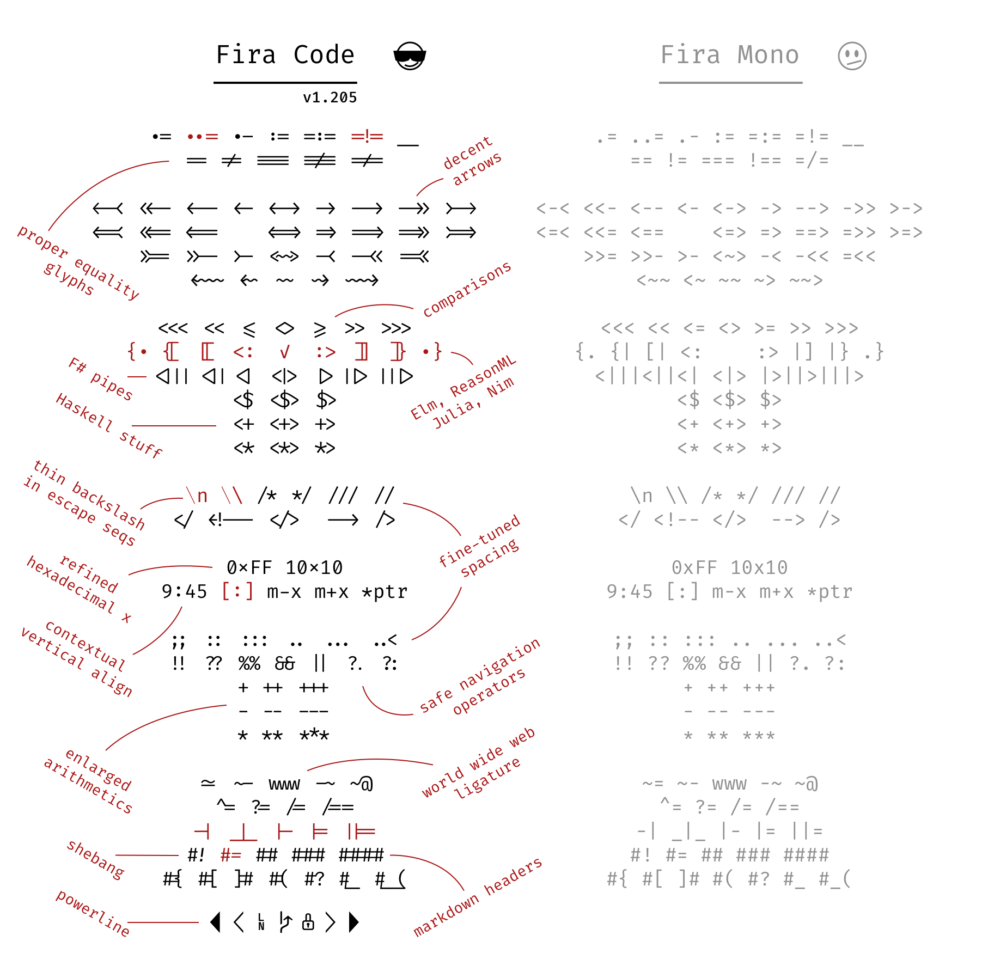

By the end of this tutorial, our terminal will look like this:


These are step by step instructions from the very start to install everything we need. I'm assuming some of you have never done this before so I've been explicit where possible.

If you can't wait and aren't interested in the reasons why, there is a TLDR at the bottom of this article, which only takes a few seconds!

## [Homebrew](https://brew.sh/)

> The missing package manager for macOS

We will use homebrew throughout this process, it's a community maintained package manager for OSX, akin to `apt` on debian/ubuntu.

In your current terminal we're going to follow the instructions from [Homebrew](https://brew.sh/):

```$ /usr/bin/ruby -e "$(curl -fsSL https://raw.githubusercontent.com/Homebrew/install/master/install)"```

This will install homebrew and allow us to use `brew` from here on.

Lets also install [wget](https://www.gnu.org/software/wget/) whilst we're doing this, to download files with

```
brew install wget
```

## [ZSH](https://www.zsh.org/)

We're going to use ZSH so that we can install a bunch of plugins not available via Bash natively. ZSH is a different type of shell environment and allows us to make the customisations we want.

By default OSX has ZSH installed, but we're going to use homebrew to install ZSH to we can upgrade or uninstall it at any given time with ease.  

I followed [these instructions by Rick Cogley](https://rick.cogley.info/post/use-homebrew-zsh-instead-of-the-osx-default/) to install it, I've copied his instructions here for you and ommitted some of the detail just to speed things up: 

**Confirm the current active zsh version:**

```$ zsh --version```

**Confirm the location of zsh:**

```
which zsh
/bin/zsh
```

**Confirm the shell that’s set for your user:**

```
dscl . -read /Users/$USER UserShell
UserShell: /bin/zsh
```
**Install ZSH:**

```
brew install zsh
```

**Use brew ZSH:**

```
sudo dscl . -create /Users/$USER UserShell /usr/local/bin/zsh
Password: *********
```

After that, restart your Terminal to have it take effect.

Now if you run `which` again, you’ll see the system is recognizing the one you installed:

```
which zsh
/usr/local/bin/zsh
```

**Confirm you're running brew ZSH:**

```
dscl . -read /Users/$USER UserShell
UserShell: /usr/local/bin/zsh
```

**Set the shell in Terminal App: ** 
Open Preferences > General > “Shells Open With” and set the path to your preferred shell.

Ok cool, so now we have ZSH installed and we've switched from Bash to ZSH.

## [iTerm2](https://iterm2.com/)

> iTerm2 is a terminal emulator for macOS that does amazing things

```
brew cask install iterm
```

We will be installing [iTerm2](https://www.iterm2.com/), which is the most popular terminal replacement for MacOS due to it's customisable nature and user friendly GUI features.

iTerm will be installed in your app directory, feel free to fire it up and continue from here.

It's the app featured in this tutorial and all the screenshots.

## Fonts

Let's install some fonts and make them available to to iTerm so that you can get nice fancy icons that we will need for one of the ZSH plugins we are installing later on.

### [Nerd fonts](https://github.com/ryanoasis/nerd-fonts)

> Iconic font aggregator, collection, and patcher. 40+ patched fonts, over 3,600 glyph/icons, includes popular collections such as Font Awesome & fonts such as Hack
First we install [Nerd Fonts](https://github.com/ryanoasis/nerd-fonts) for the icons

```
brew tap caskroom/fonts
brew cask install font-hack-nerd-font
```


### [Fira Code](https://github.com/tonsky/FiraCode)
> Monospaced font with programming ligatures

```
brew tap caskroom/fonts
brew cask install font-fira-code
``` 



## [One Dark theme](https://atom.io/themes/one-dark-syntax)
> A dark syntax theme

```
wget https://raw.githubusercontent.com/nathanbuchar/atom-one-dark-terminal/master/scheme/iterm/One%20Dark.itermcolors
```

You can choose any colour scheme you like, my preferred is One Dark which was originally a theme for [Atom](https://atom.io/themes/one-dark-syntax).  
I chose to use the port made by [Nathan Buchar](https://github.com/nathanbuchar/atom-one-dark-terminal) because it's the most actively maintained for iTerm.


This will download to your current directory.

### Colours
Open preferences in iTerm and navigate to `Profiles > Colors` then in bottom right, from the dropdown `color presets` choose `import...` and import the file we downloaded.


### Fonts
Change your fonts in the `text` tab.  
Change *Font* to `Fira Mono` and *Non ASCII Font* to `Fira Code Regular`, I chose 12pt size for each.

Finally under the `Other actions` dropdown on the left corner, choose `Set as default`

## [Zplug](https://github.com/zplug/zplug)

> A next-generation plugin manager for zsh

Finally we pull it all together and use [Zplug](https://github.com/zplug/zplug).


```
brew install zplug
```


There are other alternatives out there, such as [Oh My ZSH](https://ohmyz.sh/), [Antigen](http://antigen.sharats.me/) and [Antibody](https://getantibody.github.io/) but I've found for performance, management and customisation Zplug beats them all.


Zplug lets you use Oh My ZSH (OMZ) plugins, which is pretty much the standard for anyone customising ZSH. Most people stick with OMZ but I've found it to be slow and bloated, moreover, I dont need all the plugins included anyway. Feel free to use any of the above if you feel otherwise, but I'll be sharing my presets for my setup with Zplug. 

Zplug is a well thought out and structured system:


Next we add our settings to the `~/.zshrc` file.

Here is a copy of my own [.zshrc](https://gist.github.com/Demwunz/e98777abeee1bd1e6ac74f7a9827a97e) file:

After you've copied the below rules to your own `~/.zshrc` file you need to run 

```zplug load``` 

which will source the plugins and add commands to your `$PATH`

```
# stop these errors https://github.com/asdf-vm/asdf/issues/266
# & make it fast https://carlosbecker.com/posts/speeding-up-zsh/
autoload -Uz compinit 
if [ $(date +'%j') != $(stat -f '%Sm' -t '%j' ~/.zcompdump) ]; then
	compinit;
else
	compinit -C;
fi;

##########################################################
export ZPLUG_HOME=/usr/local/opt/zplug
source $ZPLUG_HOME/init.zsh

# Make sure to use double quotes #########################
zplug "zsh-users/zsh-history-substring-search"
zplug "zsh-users/zsh-completions"
zplug "zsh-users/zsh-autosuggestions"
#zsh-completions
fpath=(/usr/local/share/zsh-completions $fpath)

# oh-my-zsh ##############################################
zplug "plugins/git", from:oh-my-zsh
zplug "plugins/github", from:oh-my-zsh
zplug "plugins/heroku", from:oh-my-zsh
zplug "plugins/lein", from:oh-my-zsh
zplug "plugins/command-not-found", from:oh-my-zsh
zplug "plugins/autojump", from:oh-my-zsh
zplug "plugins/compleat", from:oh-my-zsh
zplug "plugins/ssh-agent", from:oh-my-zsh
# Node Plugins
zplug "plugins/node", from:oh-my-zsh
# Python Plugins
zplug "plugins/python", from:oh-my-zsh

# Load if "if" tag returns true
zplug "lib/clipboard", from:oh-my-zsh
zplug "oz/safe-paste"

# Note: To specify the order in which packages should be loaded, use the defer
#       tag described in the next section

# Set the priority when loading
# e.g., zsh-syntax-highlighting must be loaded
# after executing compinit command and sourcing other plugins
# (If the defer tag is given 2 or above, run after compinit command)
zplug "zsh-users/zsh-syntax-highlighting", defer:2

# Load theme file ########################################
zplug denysdovhan/spaceship-prompt, use:spaceship.zsh, from:github, as:theme

# Install plugins if there are plugins that have not been installed
if ! zplug check --verbose; then
    printf "Install? [y/N]: "
    if read -q; then
        echo; zplug install
    fi
fi

zplug load
```

As you install Zplug, you'll see some nice output in your terminal.

## [Spaceship prompt](https://github.com/denysdovhan/spaceship-prompt)

> A Zsh prompt for Astronauts

Zplug allows you to reference a github repo just by username and repo and loading as a theme.

We have gone for Spaceship Prompt, which is on [line 49 of my .zshrc file](https://gist.github.com/Demwunz/e98777abeee1bd1e6ac74f7a9827a97e#file-zshrc-L49)

[Spaceship Prompt](https://github.com/denysdovhan/spaceship-prompt) gives you information about the directory you are working in, particularly information about:

- git/mercurial branch, 
- package (npm for example)
- language version information (node, python,ruby and lots more)
- low battery indicator
- plus much more...	


Restart your terminal and you should be all set to go!

## Bonus

### [Exa](https://the.exa.website/)
 
```
brew install exa
```

> A modern replacement for `ls`.


As you could see in the original screenshot at the top of this page, the folders and files were nicely highlighted by [Exa](https://the.exa.website/). 
It can do all kinds of nifty things for example show you a tree view of a directory.


### [The Fuck](https://github.com/nvbn/thefuck) (yes...really)

> Magnificent app which corrects your previous console command.
 
```
brew install thefuck
```

If you ever make mistakes, as I often do, like in the original screenshot at the top, It can be a pain in the neck to type out the correct command again, or respond to the command line output, this is where [the fuck](https://github.com/nvbn/thefuck) comes in. 

In your `~/.zshrc` file you will need to add the following line, after the zplug rules: 

```
eval "$(thefuck --alias)"

```


You simply type `fuck` (or something else if you change it in the settings) and it will attempt to work out how to resolve your problem and you can confirm or cancel.

You can see the full [features in the documentation](https://github.com/nvbn/thefuck#how-it-works)

Also [see what Osho has to say about the word fuck](https://www.youtube.com/watch?v=6D7rWLzloOI).


## tldr; version
Assuming you already have Homebrew installed and are familiar with ZSH, here is the tldr; version:

```
brew install wget zsh zplug exa thefuck asdf
brew tap caskroom/fonts
brew cask install font-hack-nerd-font font-fira-code iTerm
```
	
Copy and amend the contents from this [gist](https://gist.github.com/Demwunz/e98777abeee1bd1e6ac74f7a9827a97e) and then launch iTerm

---
