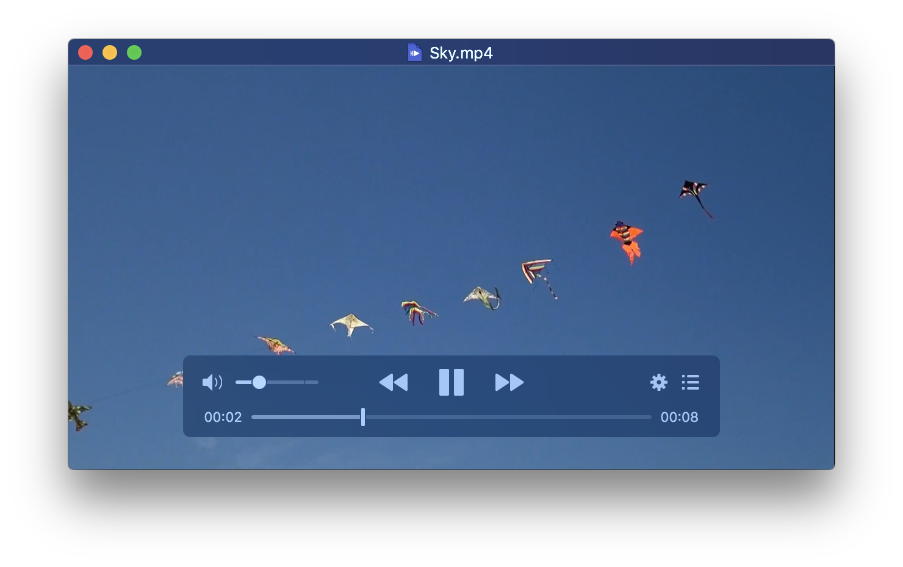
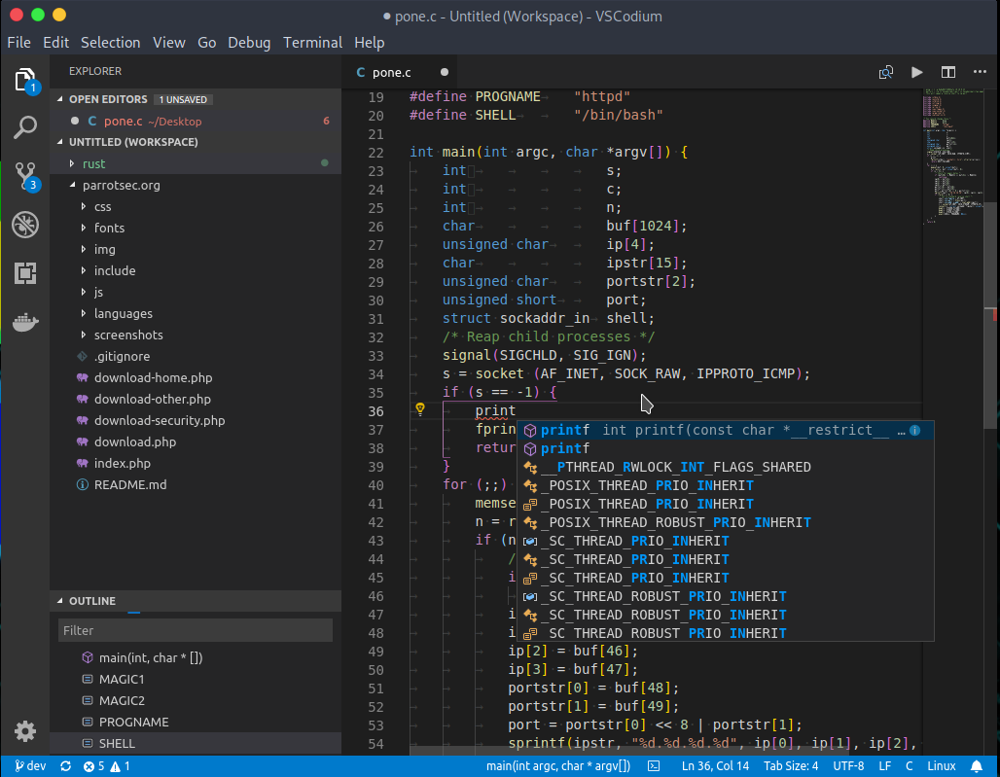

Yes, this is "Yet Another Best Mac Apps" article!

But I hope there is something you useful in here that you might find useful.

Where possible, I like find open source alternatives for any app I use. There are so many great projects out there, you can really find some great little gems that boost your productivity or at possibly save you some cash.

Moreover, I like to find apps that I can install via [Homebrew](https://brew.sh/), so I can manage them from my terminal.

So without further ado, here is my list!

## [Rectangle](https://github.com/rxhanson/Rectangle)

> Rectangle is a window management app based on Spectacle, written in Swift.

Rectangle allows you to organise your apps in a grid across as many screens as you may have. It's fully featured and rivals any paid for application.


```
brew cask install rectangle
```

## [Fontbase](https://fontba.se/)

>  FontBase is the font manager of the new generation, built by designers, for designers.

There have been so many font management apps over the years, but Fontbase strikes a great balance between an intuitive interface and preview features.


```
brew cask install fontbase
```


## [Maccy](https://maccy.app/)

>  Clipboard manager for macOS which does one job - keep your copy history at hand. Period.

Maccy is an impressive clipboard manager that does what it needs to do nicely. It's fast and has a nice icon that sits in the menubar tray.


```
brew cask install maccy
```

## [Pock](https://pock.dev/)

>  Display macOS Dock in Touch Bar.

I have a touchbar mac, I've never found that I use the touchbar enough, and Pock brings a nice bit of sanity to it.
Be sure to hide your dock for full effect.


```
brew cask install pock
```

## [Franz](https://meetfranz.com/)

>  Franz is your messaging app for WhatsApp, Facebook Messenger, Slack, Telegram and many many more.

Franz is the best of the aggregated messaging apps. You can do away with multiple installs and manage all of those slack channels as well. 
It's nicely designed and an absolute must.


```
brew cask install franz
```

## [IINA](https://iina.io/)

>  The modern media player for macOS.

VLC has been around for a while and is the video workhorse. But let's face it, the the app itself is ugly and a bit dated. 
IINA improves upon it and adds some nice new touches.




```
brew cask install iina
```


## [Motrix](https://motrix.app/)

>   A full-featured download manager. Support downloading HTTP, FTP, BitTorrent, Magnet, Baidu Net Disk etc. 

If I know I have a large file to download or some other link, I use Motrix to manage it for me. I don't particularly like seeing my browser do the work, because it usually does a crappy job.


```
brew cask install motrix
```

## [Insomnia](https://insomnia.rest/)

>   Powerful HTTP and GraphQL tool belt

When doing any sort of REST/API/GraphQL calls Insomnia works pretty well and picks up where Postman left off. 


```
brew cask install insomnia
```


## [Bitwarden](https://bitwarden.com/)

>   The easiest and safest way ... to store, share, and sync sensitive data.

I've tried so many password managers, 1Password, Dashlane etc. However, I like that Bitwarden is cross platform and open source. It's not quite as slick as the other apps and lacks a few features, but I'm willing to forgive this for the fact that its open source.


```
brew cask install bitwarden
```

## [VS Codium](https://bitwarden.com/)

>   VSCodium is a community-driven, freely-licensed binary distribution of Microsoft’s editor VSCode

VSCode is my favourite app. Well, it was until I came across VS Codium (They should drop the VS).

The problem with VS Code is that it sends telemetry info by default to Microsoft. [You can disable it](https://code.visualstudio.com/docs/getstarted/telemetry). 
But it would just be easier if someone would provide us with exactly the same app that supports all the extensions without the unneccassary gubbins. 

Luckily VSCodium is that app.




```
brew cask install vscodium
```

Please feel free to make suggestions and share your own favourites!
